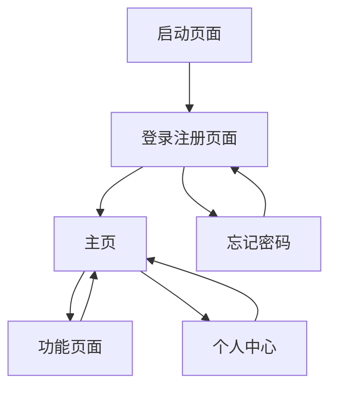

# Mowin App 产品需求文档

## 1. 产品概述
Mowin App 是一款现代化的移动应用，专注于为用户提供便捷的服务体验。该应用采用简洁直观的设计理念，通过优化的用户界面和流畅的交互体验，帮助用户高效完成各项任务。

产品旨在打造一个用户友好的移动平台，满足现代用户对便捷性、美观性和功能性的需求。

## 2. 核心功能

### 2.1 用户角色
| 角色 | 注册方式 | 核心权限 |
|------|----------|----------|
| 普通用户 | 手机号/邮箱注册 | 浏览内容、使用基础功能、个人资料管理 |
| 高级用户 | 升级或邀请码 | 访问高级功能、数据分析、优先客服支持 |

### 2.2 功能模块
我们的Mowin App包含以下主要页面：
1. **启动页面**：品牌展示、应用加载
2. **登录注册页面**：用户认证、账户创建
3. **主页**：功能导航、内容展示、快捷操作
4. **功能页面**：核心业务功能、工具集合
5. **个人中心**：用户信息、设置选项、账户管理

### 2.3 页面详情
| 页面名称 | 模块名称 | 功能描述 |
|----------|----------|----------|
| 启动页面 | 品牌展示 | 显示应用Logo、加载动画、版本信息 |
| 启动页面 | 引导流程 | 首次使用引导、功能介绍轮播 |
| 登录注册页面 | 用户认证 | 手机号/邮箱登录、密码验证、第三方登录 |
| 登录注册页面 | 账户创建 | 新用户注册、验证码验证、协议确认 |
| 主页 | 导航栏 | 底部标签导航、页面切换、状态指示 |
| 主页 | 内容展示 | 轮播图、推荐内容、快捷入口 |
| 主页 | 搜索功能 | 关键词搜索、历史记录、热门推荐 |
| 功能页面 | 核心工具 | 主要业务功能、操作界面、结果展示 |
| 功能页面 | 数据管理 | 用户数据、历史记录、收藏管理 |
| 个人中心 | 用户信息 | 头像设置、基本信息、账户状态 |
| 个人中心 | 设置选项 | 通知设置、隐私设置、主题切换 |
| 个人中心 | 账户管理 | 安全设置、绑定管理、注销账户 |

## 3. 核心流程

**新用户流程：**
用户首次打开应用 → 查看引导页面 → 注册新账户 → 完善个人信息 → 进入主页开始使用

**登录用户流程：**
用户打开应用 → 自动登录或手动登录 → 进入主页 → 使用各项功能 → 个人中心管理

**核心功能流程：**
主页浏览 → 选择功能 → 执行操作 → 查看结果 → 保存或分享

## 4. 用户界面设计

### 4.1 设计风格
- **主色调**：现代蓝色 (#007AFF)、辅助绿色 (#34C759)
- **按钮样式**：圆角矩形、渐变效果、阴影设计
- **字体**：系统默认字体，标题16-20px，正文14-16px
- **布局风格**：卡片式设计、底部导航、顶部状态栏
- **图标风格**：线性图标、简洁明了、统一风格

### 4.2 页面设计概览

| 页面名称 | 模块名称 | UI元素 |
|----------|----------|--------|
| 启动页面 | 品牌展示 | 居中Logo、渐变背景、加载动画、版本号显示 |
| 登录注册页面 | 登录表单 | 输入框圆角设计、主色调按钮、第三方登录图标 |
| 主页 | 导航栏 | 底部固定、图标+文字、选中状态高亮 |
| 主页 | 内容区域 | 轮播图圆角、卡片阴影、网格布局 |
| 功能页面 | 操作界面 | 大按钮设计、进度指示、结果展示卡片 |
| 个人中心 | 用户信息 | 圆形头像、信息列表、设置项分组 |

### 4.3 响应式设计
应用采用移动端优先设计，适配iOS和Android平台，支持不同屏幕尺寸，优化触摸交互体验，确保在各种设备上都有良好的显示效果。