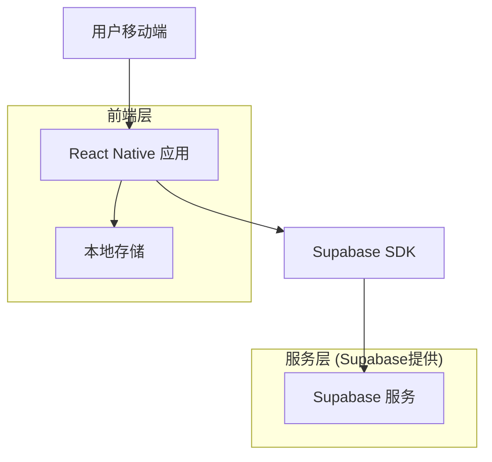
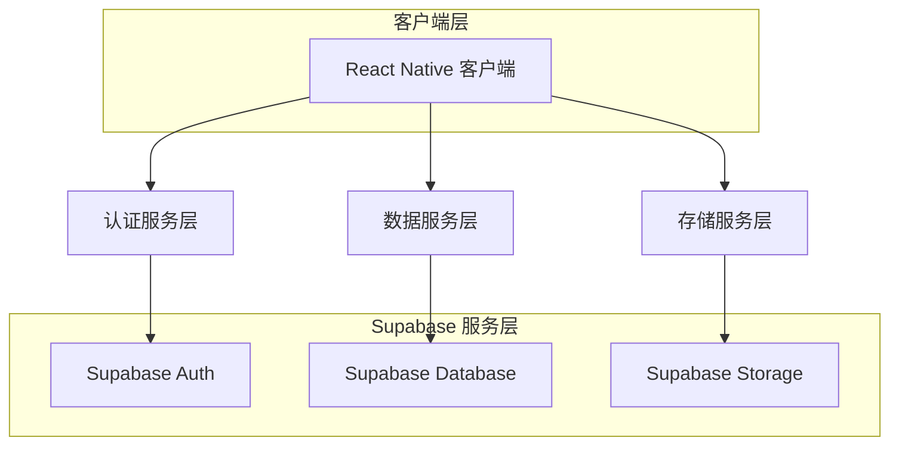
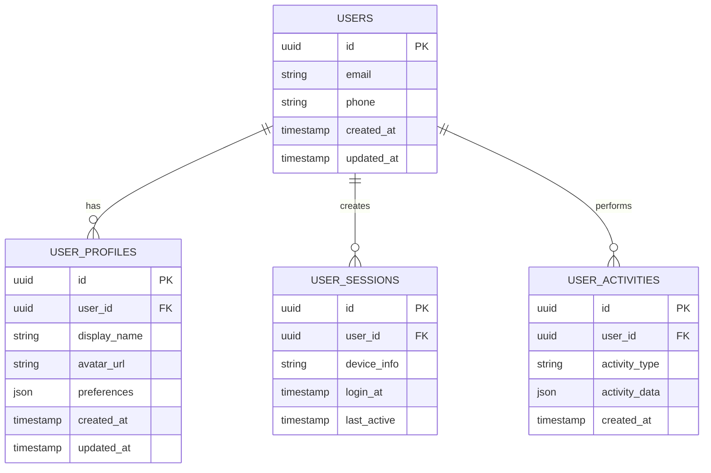

# Mowin App 技术架构文档

## 1. 架构设计



## 2. 技术描述

* 前端：React Native\@0.72 + TypeScript + React Navigation\@6

* 状态管理：Redux Toolkit + RTK Query

* UI组件：React Native Elements + Styled Components

* 后端服务：Supabase (认证、数据库、存储)

* 本地存储：AsyncStorage + MMKV

## 3. 路由定义

| 路由        | 用途                 |
| --------- | ------------------ |
| /splash   | 启动页面，显示品牌Logo和加载状态 |
| /auth     | 认证页面，包含登录和注册功能     |
| /home     | 主页，显示主要内容和导航       |
| /features | 功能页面，核心业务功能入口      |
| /profile  | 个人中心，用户信息和设置       |
| /settings | 设置页面，应用配置和偏好       |

## 4. API定义

### 4.1 核心API

用户认证相关

```
POST /auth/v1/signup
```

请求参数：

| 参数名      | 参数类型   | 是否必需  | 描述     |
| -------- | ------ | ----- | ------ |
| email    | string | true  | 用户邮箱地址 |
| password | string | true  | 用户密码   |
| phone    | string | false | 手机号码   |

响应参数：

| 参数名     | 参数类型   | 描述     |
| ------- | ------ | ------ |
| user    | object | 用户信息对象 |
| session | object | 会话信息   |

示例：

```json
{
  "email": "user@example.com",
  "password": "securePassword123",
  "phone": "+86138****8888"
}
```

用户登录

```
POST /auth/v1/token
```

请求参数：

| 参数名      | 参数类型   | 是否必需 | 描述   |
| -------- | ------ | ---- | ---- |
| email    | string | true | 用户邮箱 |
| password | string | true | 用户密码 |

响应参数：

| 参数名            | 参数类型   | 描述   |
| -------------- | ------ | ---- |
| access\_token  | string | 访问令牌 |
| refresh\_token | string | 刷新令牌 |
| user           | object | 用户信息 |

## 5. 服务架构图



## 6. 数据模型

### 6.1 数据模型定义



### 6.2 数据定义语言

用户表 (users)

```sql
-- 用户基础表由Supabase Auth自动创建和管理
-- 扩展用户配置表
CREATE TABLE user_profiles (
    id UUID PRIMARY KEY DEFAULT gen_random_uuid(),
    user_id UUID REFERENCES auth.users(id) ON DELETE CASCADE,
    display_name VARCHAR(100),
    avatar_url TEXT,
    preferences JSONB DEFAULT '{}',
    created_at TIMESTAMP WITH TIME ZONE DEFAULT NOW(),
    updated_at TIMESTAMP WITH TIME ZONE DEFAULT NOW()
);

-- 用户会话表
CREATE TABLE user_sessions (
    id UUID PRIMARY KEY DEFAULT gen_random_uuid(),
    user_id UUID REFERENCES auth.users(id) ON DELETE CASCADE,
    device_info JSONB,
    login_at TIMESTAMP WITH TIME ZONE DEFAULT NOW(),
    last_active TIMESTAMP WITH TIME ZONE DEFAULT NOW()
);

-- 用户活动记录表
CREATE TABLE user_activities (
    id UUID PRIMARY KEY DEFAULT gen_random_uuid(),
    user_id UUID REFERENCES auth.users(id) ON DELETE CASCADE,
    activity_type VARCHAR(50) NOT NULL,
    activity_data JSONB DEFAULT '{}',
    created_at TIMESTAMP WITH TIME ZONE DEFAULT NOW()
);

-- 创建索引
CREATE INDEX idx_user_profiles_user_id ON user_profiles(user_id);
CREATE INDEX idx_user_sessions_user_id ON user_sessions(user_id);
CREATE INDEX idx_user_activities_user_id ON user_activities(user_id);
CREATE INDEX idx_user_activities_created_at ON user_activities(created_at DESC);

-- 设置RLS (Row Level Security)
ALTER TABLE user_profiles ENABLE ROW LEVEL SECURITY;
ALTER TABLE user_sessions ENABLE ROW LEVEL SECURITY;
ALTER TABLE user_activities ENABLE ROW LEVEL SECURITY;

-- 创建RLS策略
CREATE POLICY "Users can view own profile" ON user_profiles
    FOR SELECT USING (auth.uid() = user_id);

CREATE POLICY "Users can update own profile" ON user_profiles
    FOR UPDATE USING (auth.uid() = user_id);

CREATE POLICY "Users can view own sessions" ON user_sessions
    FOR SELECT USING (auth.uid() = user_id);

CREATE POLICY "Users can view own activities" ON user_activities
    FOR SELECT USING (auth.uid() = user_id);

-- 授权
GRANT SELECT ON user_profiles TO anon;
GRANT ALL PRIVILEGES ON user_profiles TO authenticated;
GRANT SELECT ON user_sessions TO anon;
GRANT ALL PRIVILEGES ON user_sessions TO authenticated;
GRANT SELECT ON user_activities TO anon;
GRANT ALL PRIVILEGES ON user_activities TO authenticated;

-- 初始化数据
INSERT INTO user_activities (user_id, activity_type, activity_data)
SELECT 
    auth.uid(),
    'app_install',
    '{"version": "1.0.0", "platform": "mobile"}'
WHERE auth.uid() IS NOT NULL;
```

